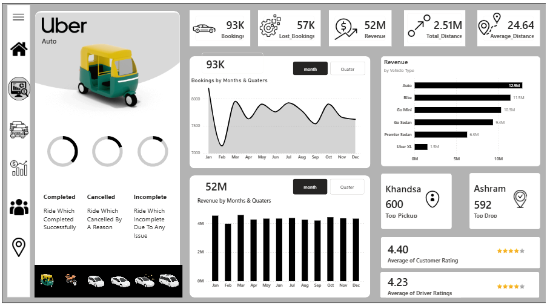
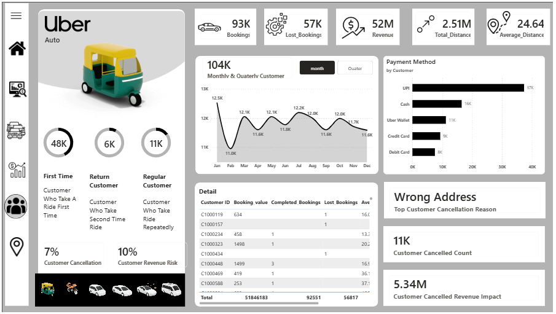
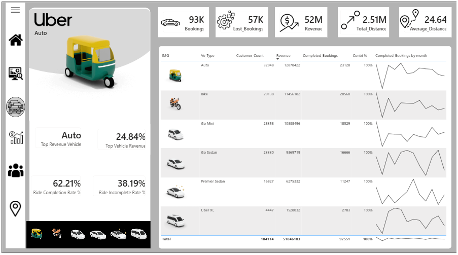
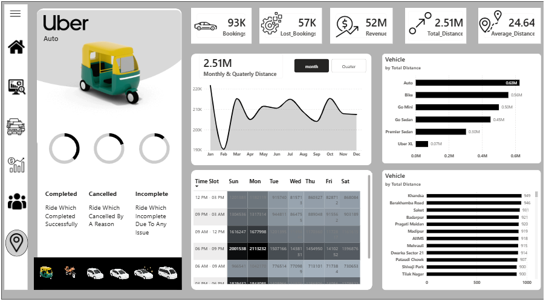

# 🚖 Uber Decision Analytics Dashboard | Power BI

## 📌 Project Overview

This project presents an end-to-end **Business Intelligence and Decision Analytics solution** for Uber ride operations using **Power BI**. The dashboard analyzes booking trends, customer behavior, revenue, vehicle performance, ride cancellations, and operational KPIs to generate actionable business insights.

The objective is to transform raw booking data into meaningful visualizations that support strategic and operational decision-making.

---

## 🎯 Business Problem

Ride-hailing companies generate millions of booking records every day. Converting this operational data into actionable insights is essential for improving customer experience, maximizing revenue, reducing cancellations, and optimizing fleet utilization.

This dashboard answers key business questions such as:

- Which vehicle category generates the highest revenue?
- What are the monthly booking and revenue trends?
- Which payment methods are most preferred?
- What are the major causes of ride cancellations?
- Which pickup and drop locations have the highest demand?
- How efficiently are different vehicle categories utilized?

---

# 🛠 Tech Stack

- Power BI Desktop
- Power Query
- DAX Measures
- Data Modeling
- Business Intelligence
- Dashboard Design

---

# 📊 Dashboard Pages

## 1️⃣ Overview Dashboard

Provides a high-level summary of business performance including:

- Total Bookings
- Total Revenue
- Total Distance Travelled
- Average Trip Distance
- Monthly Booking Trend
- Revenue Trend
- Top Pickup Location
- Top Drop Location
- Average Customer Rating
- Average Driver Rating



---

## 2️⃣ Customer Analytics

Analyzes customer behavior including:

- First-time Customers
- Returning Customers
- Regular Customers
- Customer Cancellation Rate
- Customer Revenue Risk
- Preferred Payment Methods
- Customer Booking Trend
- Customer Cancellation Reasons



---

## 3️⃣ Revenue Analytics

Focuses on financial performance through:

- Monthly Revenue Trend
- Revenue by Vehicle Type
- Revenue by Payment Method
- Average Revenue per Booking
- Revenue per Kilometer
- Revenue Lost due to Cancellations
- Top Revenue Generating Customers


---

## 4️⃣ Vehicle Performance

Evaluates operational efficiency of different vehicle categories.

KPIs include:

- Top Revenue Vehicle
- Vehicle Revenue Share
- Ride Completion Rate
- Ride Incompletion Rate
- Completed Bookings
- Vehicle-wise Revenue
- Vehicle-wise Customer Count
- Vehicle-wise Booking Trend



---

## 5️⃣ Location Analytics

Provides geographical insights into ride demand.

Includes:

- Total Distance by Vehicle
- Heatmap of Booking Time Slots
- Highest Demand Locations
- Most Popular Routes
- Vehicle Distance Distribution



---

# 📈 Key Performance Indicators

- Total Bookings
- Revenue
- Average Trip Distance
- Ride Completion Rate
- Ride Cancellation Rate
- Lost Revenue
- Revenue per Booking
- Revenue per Kilometer
- Customer Ratings
- Driver Ratings

---

# 💡 Key Business Insights

### Customer Insights

- Returning customers contribute significantly to total bookings.
- UPI is the most preferred payment method.
- Customer cancellations primarily occur due to change of plans.

### Revenue Insights

- Auto category contributes the highest overall revenue.
- Revenue remains relatively stable across months with seasonal fluctuations.
- Cancelled rides result in significant revenue loss.

### Operational Insights

- Certain pickup locations consistently generate higher booking volumes.
- Vehicle utilization differs across categories.
- Monitoring cancellation patterns can improve driver allocation.

---

# 📊 Business Recommendations

- Increase driver availability during high-demand periods.
- Improve customer communication to reduce cancellation rates.
- Promote digital payment incentives to further increase UPI adoption.
- Optimize fleet allocation based on vehicle demand.
- Investigate frequently cancelled routes for operational improvements.
- Introduce targeted promotions for underutilized vehicle categories.

---

# 📂 Repository Structure

```
Uber-Decision-Analytics
│
├── dashboard
│   └── Uber.pbix
│
├── images
│   ├── Overview.png
│   ├── Customer.png
│   ├── Revenue.png
│   ├── Vehicle.png
│   └── Location.png
│
├── report
│   ├── Business_Insights.docx
│   └── Dashboard_Presentation.pptx
│
├── sql
│   └── business_queries.sql
│
└── README.md
```

---

# 🚀 Future Enhancements

- SQL-based data pipeline
- Python exploratory data analysis
- Predictive demand forecasting
- Driver performance prediction
- Customer segmentation
- AI-assisted business insight generation
- Power BI Service deployment with scheduled refresh

---

# 📌 Skills Demonstrated

- Business Intelligence
- Decision Analytics
- Dashboard Development
- Data Modeling
- KPI Design
- Data Visualization
- Power BI
- DAX
- Power Query
- Business Storytelling
- Analytical Thinking
- Data-Driven Decision Making

---

## ⭐ If you found this project useful, feel free to star the repository.
